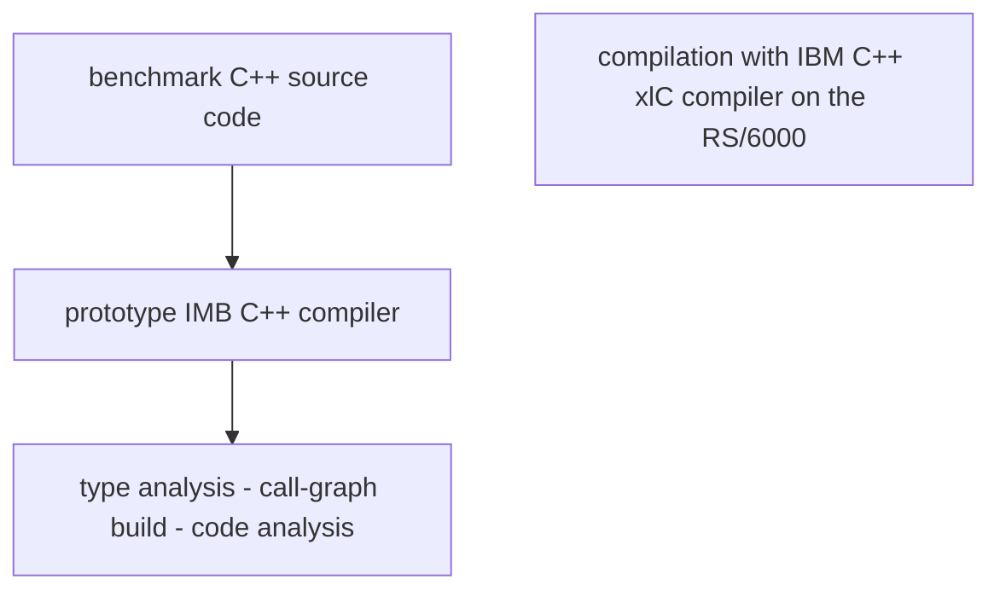

## Abstract

- 3 **static analysis algorithms**
- improve c++ programs by **resolving virtual function calls** and **reducing compiled code size**
- **benchmarks** on 7 programs of significant size (5 to 20 kloc)
- the most precise of the 3 algorithms (**RTA**) resolved **71%** of the **virtual function calls** and reduced the **compiled code size** by **21%**

---

## Introduction

- an advantage of **object-oriented** languages is **abstraction**
- the most important feature that supports abstraction is the **dynamic dispatch of methods based on the run-time type of an object**
- instead of considering all dispatches as dynamic, c++ requires programmers to explicitly request dynamic dispatch by declaring a method as **virtual**

---

- **virtual function calls** represent a significant source of opportunities for **program optimization**
- one of them is **execution time overhead**
- **virtual function call resolution** can result in significant performance improvements in execution time performance
- another of them is **code size reduction** (consequently **object-code size**)
- with virtual function calls, the **call graph** is bigger as each **virtual call site** has **multiple potential targets** which, without further knowledge, are all **included** in it

---

- **comparison** of 3 fast static analysis algorithms for resolving virtual function calls and issues deriving from them
- use of dynamic measurements to place an **upper bound** on the potential of static analysis methods
- comparison with more sophisticated analyses like **alias analysis**
- comparison by **speed measurements** (they are fast enough to be included in commercial-quality compilers)

---

## Static analysis

- _Unique Name_ (**UN**)
- _Class Hierarchy Analysis_ (**CHA**)
- _Rapid Type Analysis_ (**RTA**)

---

## Figure 1

```cpp
class A {
  public:
    virtual int foo() { return 1; }
};

class B: public A {
  public:
    virtual int foo() { return 2; }
    virtual int foo(int i) { return i+1; }
};

void main() {
  B* p = new B;
  int result1 = p->foo(1);  // UN, CHA, RTA
  int result2 = p->foo();   // CHA, RTA
  A* q = p;
  int result3 = q->foo();   // RTA
}
```

---

## Unique Name (UN)

- **link-time strategy** = optimization confined to information available in the **object file**
- comparing the **mangled names** of the functions in the object file is observed that in some cases there is only 1 implementation of a particular virtual function anywhere in the program
- when a function has a **unique name** (signature) the **virtual call** is replaced with a **direct call**
- **advantage** = it does not require access to source code and can optimize virtual calls in library code
- **disadvantage** = it operates on object code (optimizations such as inlining are not available)

---

- in **Figure 1** **Unique Name** is able to resolve **only** the first call (`result1`) because there is only one virtual function called `foo` that takes an `integer` parameter `B::foo(int)`

---

## Class Hierarchy Analysis (CHA)

- combine **static information** with **class hierarchy** to determine the targets of a virtual function call
- **advantage** = it can **ignore** identically-named functions in unrelated classes
- **disadvantage?** = it must have the **complete program available** for analysis
- we have to build a **call graph** starting from `main()`, that has to include **functions reachable** from `main()` as well as from the **constructors** of **global-scope objects**

---

- in **Figure 1** **Class Hierarchy Analysis** is able to resolve **also** the second call (`result2`) because there are no derived classes of `B`, so the only possible target is `int B::foo()`
- `q->foo()` is **not** resolved by **CHA** because the **static type** of `q` is `A*` and so the **dynamic type** of the object could be **either** `A` or `B`

---

## Rapid Type Analysis (RTA)

- starts with a **call graph** generated by performing **CHA** and uses information about instantiated classes to **reduce the set of executable virtual functions**, reducing the size of the call graph
- **advantage** = inherits the benefits of **CHA**: is **flow-insensitive** and does **not** keep **per-statement information**, so it's **very fast**
- **advantage** = very effective in conjuction with class libraries
- **disadvantage** = inherits the limitations of **CHA**: it **must** analyze the **entire** program
- it builds the set of possible instantiated types **optimistically**:
  - it starts assuming that **no functions** except `main` are called and that **no objects** are instantiated (therefore no **virtual call sites** call any of their target functions)
  - it traverses the **call graph** created by **CHA** starting at `main` and ignoring **any** virtual call site
  - when a **constructor** for an object is found to be **callable**, any of the **virtual methods** of the corresponding class are **traversed** as well
  - consequently the **call graph grows iteratively**

---

- in **Figure 1** **Rapid Type Analysis** is able to resolve **also** the third call (`result3`) because the examination of the entire program shows that **no objects** of type `A` are created, so `A::foo()` can be **eliminated** as a possible target of the call. This leaves only `B::foo()`

---

## Other analysis - flow-sensitive analysis

```cpp
A* q = new B;
q = new A;
result = q->foo();
```

- **flow-sensitive analysis** is able to resolve this call because it knows that `q` points to an object of type `A`
- **RTA** is **not** able to resolve this call because both `A` and `B` objects are created in this program

---

## Type safety issues

- **CHA** and **RTA** rely on the **type-safety** of the programs

```cpp
void* x = (void *) new B;
B* q = (B*) x;
int case1 = q->foo();
```

- this snippet is **type-safe** because the **down-cast** is to the **correct type**

```cpp
void* x = (void *) new A;
B* q = (B*) x;
int case2 = q->foo();
```

- this snippet is **not type-safe** and the compiler is justified in generating code the **raises and exception** at the point of the virtual function call `foo`
- but, because `foo` is defined for `A`, most existing compilers generate code that calls `A::foo();` (maybe this is **not** what the programmer indented)

```cpp
int case3 = q->foo(666);
```

- in this third case, the program will result in an **unidentified run-time behavior** (most like a segfault) because `A` **virtual function table VFT** does not contain an entry for `foo(int)`

---

- `case1` is **clearly legal**, `case3` is **clearly illegal**
- in general, it's **not** possible to **distinguish** the 3 cases **statically**
- in `case2`, **CHA** unfortunately would determine that the call was resolvable to `B::foo()`, which is **incorrect**
- in `case2`, **RTA** would determine that there are **no possible** call targets

---

- therefore, **CHA** and **RTA** either need to be **disabled** whenever a downcast is encountered or they can be **allowed** to proceed with a **warning** to alert the programmer that optimization could change the results of the program if the downcasts are truly **unsafe**

---

## Experimental results

- solve the problems outlined in the Introduction:
  - **execution time performance**
  - **code size**
  - **perceived program complexity**
- when possible, use **dynamic measurement information** to place an **upper limit** on that could be achieved by **perfect static analysis**

---

## Methodology



- **traced** benchmarks
- executions **simulated** from the **instruction trace** to gather relevant **execution-time statistics**
- **line number** and **type info** to match up the **call sites** in the **source** and **object code**
- use of both **optimized** and **unoptimized** compiled versions of the benchmarks
- the **unoptimized** version is only used to match the virtual call sites in the source and object code, because **optimization** includes **inlining**, which **distorts the call graph** (optimization does not change **virtual calls numbers**)
- all measurements are for **optimized code**
- virtual calls in **library code** is **not available** because the tool analyzes **benchmarks source code only** (except for `simulate`)

---

## Benchmarks

- IBM's AIX os and C++ run-time environment
- use of percentages because the absolute numbers vary so much
- benchmark programs:
  - programs made up of production code with demo drivers
    - `idl taldict`
  - programs used to solve real problems
    - `sched ixx lcom hotwire simulate`
  - included for comparison with other papers
    - `richards deltablue`
- **Table 1**: describes benchmark programs  
  
- **Table 2**: provides an overview of the **static characteristics** (**static complexity**) of the benchmark programs in absolute terms (**user code only**):  
  
  - number of functions
  - number of call sites
  - number of live call sites (**executed in traces**)
  - number of virtual call sites
  - number of non-dead virtual call sites (**resolved or unresolved call sites** that remained in the program **after RTA** (the most aggressive analysis) **removed** some of the dead functions and virtual call sites they contained)
  - number of virtual call arcs
- **Table 3**: provides an overview of the **dynamic characteristics** (**execution time**) of **optimized code** the benchmark programs (**user code only**):  
  
  - the number of instructions between virtual function calls is an excellent indication of how much potential there is for **speedup** from **virtual function resolution**
- **Figure 2** is a bar graph showing the distribution of **types** of **live calls** contained in the user code of the programs  
  
- **Figure 3** is a bar graph showing the analogous figure for the **number of dynamic calls** in user code  
  
- **Direct (non-virtual) method calls** account for an average of 51% of the **static call sites** but only 39% of the **dynamic calls**
- **Virtual method calls** account only 21% of the **static call sites** but a much more significant 36% of the total **dynamic calls**
- **Indirect function calls** and **Pointer-to-member calls** are so infrequently used that **do not appear** on the bar chart
- (except `taldict`), since **non-virtual** and **virtual** method calls are about **evenly mixed** and **direct (non-method) calls** are less frequent, we can conclude that the programs are written in a **relatively object-oriented style**

---

- **Trivially resolvable virtual function calls are implemented as direct calls**

```cpp
A a;
a.foo();
```

- is considered a **direct call** even if `foo()` is a **virtual function**

---

## Resolution of virtual function calls

- **Monomorphism**: when a **virtual call site** always calls the **same function** during 1 or more runs of the program
  - if an **optimizer** can prove that a **monomorphic call** will **always** call the same function, then it can be **resolved statically**
- **Polymorphism**: when a **virtual call site** calls **more functions** during 1 or more runs of the program
- show the **cumulative effect** of **UN**, **CHA** and **RTA** on a single bar in the chart since **CHA** resolves a **superset** of the virtual calls resolved by **UN** and **RTA** resolves a **superset** of the virtual calls resolved by **CHA**

---

- **Performance analysis**:
  - **Figure 4**: presents the **static information** for the call sites
    
  - **Figure 5**: presents the **dynamic information** for the calls in program traces
    
- **Colors**:
  - **Black**:
    - is used to label things that could **not** be handled by **static analysis**
    - in the case of **virtual function resolution**, represents the **call sites** or **calls** that are **polymorphic**
  - **White**:
    - represents the **region** of possible **opportunity** for **finer analysis**
    - in the case of **virtual function resolution**, represents the **call sites** or **calls** that are **dynamically monomorphic** but are **not resolved** by any of the **static analysis methods implemented**
  - **Diagonally striped section**:
    - for **graphs of static quantities**, labels ad additional **region of opportunity in unexecuted code**
    - for **virtual function resolution**, represents the **call sites** that are **not resolved** and are **not executed at run-time** (they may be **dead**, **monomorphic** or **polymorphic**)

---

- if the **region of opportunity** is very small then the **dynamic trace** gives a **tight upper bound** (**no static analysis could do much better**)
- if the **white region** (for static graphs, the **striped region**) is large, the **dynamic trace** gives a **loose upper bound** (**a more powerful static analysis might be able to do better**)

---

- **Figure 5**:
  - **RTA** in 5 out of 7 cases does a essentialy perfect job
    - on average resolves 71% of the **dynamic calls** in the 7 benchmarks
  - **CHA** is quite effective
    - on average resolves 51% of the **dynamic calls** in the 7 benchmarks
  - **UN** performs relatively poorly
    - on average resolves 15% of the **dynamic calls** in the 7 benchmarks

---

- (except `ixx lcom`) the benchmarks are monomorphic
- `lcom` is **not type-safe** (down-casts and strange programming practices) and applying **RTA** or **CHA** generates some **specious call site resolutions** (need to turn them off)

---

## Why RTA wins (w.r.t. CHA)

- `ixx`: solves a small number of additona static call sites, 20% of the **total synamic virtual function calls** (`String` derived classes)
- `taldict`: resolving the remaining 19% of **unresolved virtual calls** (hash table derived class, base class not created)
- `hotwire`: perfect example of the **class library scenario** in which **all the live virtual call sites are resolved**

---

## Why Fast static analysis fails

- `sched` poor perfomances of all 3 static analysis algorithms evaluated
  - only 10% of the dynamic calls are resolved, even though 30% of the static calss sites are resolved and 100% of the dynamic calls are **monomorphic** - - strange programming practice, virtual functions in the base class with `assert(false)` as body
  - disjoint derived classes with different implementations of the virtual functions
- `lcom` in which none of the static analyses do a very good job
  - 45% of the virtual calls are **monomorphic** but **unresolved**
  - 40% of the virtual calls are from a single unresolved call site
  - probably not resolvable by simple flow analysis, it could be resolved by **alias analysis**

---

- **CHA** can resolve monomorphic virtual calls for which there is only a single possible target
- **RTA** also eliminates monomorphic calls when only 1 of the possible target object types is used in the program
- the kind of monomorphic calls that can't be resolved by **RTA** occur when **multiple related object types** are used **indipendently** (**Disjointed polymorphism**)
- **Disjointed polymorphism** is quite uncommon and presents major opportunities for **alias analysis** to improve upon fast static techniques

---

## Code size

- because they build a **call graph**, **CHA** and **RTA** identify some functions as **dead** (not reachable and not included in the call graph)
- **RTA** is more precise because it **removes virtual call arcs to methods of uninistanciated objects** from the call graph
- code size **measurements** are for **unoptimized code** (`deltablue` is excluded from the test)

---

- **Figure 6**: shows the effect of **static analysis** on **user code size**  
  
  - **White** represents the **region of opportunity** for **finer analysis** (functions that are **not live** during the trace and **are not eliminated** by static analysis)

---

- the measurements include:
  - **first-order effects** of code size **reduction** due to the **elimination of entire functions**
  - **secondary-order effects** of code size **reduction** caused by **resolving virtual call sites** (calling sequences for **direct calls** are **shorter** than for **virtual calls**)
- the measurements do **not** include:
  - potential code **expansions** or **contraction** caused by **inlining of resolved call sites**

---

- on average 42% of the code in the 7 benchmarks **is not executed** during the traces
- **CHA** eliminates an average of 24% of the code
- **RTA** eliminates an average of 25% of the code
- (except `ixx idl`) in 5 of the 7 benchmarks, less than 20% of the code is **neither executed nor eliminated** by static analysis (well job of **CHA** and **RTA**)
- **RTA** does substantially better than **CHA** at **virtual function resolution** but does **not** make much difference in **reducing code size**
- **UN** does **not remove any functions** because it only resolves virtual calls (it does **not** build a call graph)

---

## Static complexity

- in presenting a user with a program browser, the task of **understanding** the program is significantly **easier** if large numbers of **dead functions are not included** and if **virtual function that can not be reached are not included at virtual call sites**
- the **cost** and **precision** of other forms of **static analysis** and **optimization** are **improved** when the **call graph** is **smaller** and **less complex**

---

- **Figure 7**:  
  
  - shows the effect of static analysis on **eliminating functions** from the call graph
  - similar to **Figure 6** but here **each function is weighted equally**, instead of **being weighted by the size of the compiled code**
  - **UN** does not eliminate any function, **CHA** eliminates a large amount of them and **RTA** eliminates a few more than **CHA**

---

- **Figure 8**:  
  
  - shows the effect of static analysis on the **number of virtual call arcs** in the call graph
  - at a **virtual call site** in the call graph, there is **an arc from the call site to each of the possible virtual functions that could be called**
  - **CHA** removes call arcs because it eliminates functions
  - **RTA** can both remove **dead functions** and **virtual call arcs in live functions**

---

- despite the large number of virtual call sites that are resolved, relatively **few** virtual call arcs are **removed** in 3 of the 7 benchmarks
- **RTA** does better than **CHA** (see `hotwire`) because removes call arcs in live functions

---

## Speed of analysis

- **Table 4**:  
  
  - shows the cost of performing **CHA** and **RTA** algorithms on an 80MHz PowerPC 601 (modest CPU) (**UN** not included cause performs poorly, implemented on top of **CHA**)
  - total time to **compile and link** the program is included for comparison
  - **RTA** analyzes an average of 3310 non-black source lines per second
  - **CHA** is only **marginally faster**
  - the code of the implementation is not optimized so the timings could be improved
  - `lcom` 17278 loc was analyzed in 6.5 seconds by **RTA** (3% of the time required to compile and link the code)
  - on average **RTA** took 2.4% of the total time to compile and link the program
  - even without improvement, this **RTA** implementation is faster enough to include in a production compiler without significantly increasing compile times

---

## Type prediction in C++

- _Comparison with Aigner and Holzle [3]_ (elimination of virtual function calls via **CHA** and **profile-based type prediction**)
- **Type prediction**:
  - **advantages**:
    - resolves **more** calls
    - does **not rely** on the **type-correcness** of the program
  - **disadvantages**:
    - requires the introduction of a **run-time test**
    - requires **profiling**
    - potentially depends on the **input** used during the **profile**
- maybe the **combination** of static analysis with type prediction is likely to be the best solution
- Type prediction can **always** resolve more virtual calls than static analysis, the execution time benefits from static resolution are greater

---

## Alias analysis for C++

- **Interprocedural flow-sensitive alias analysis**:
  - the most precise and expensive proposed static method for resolving virtual function calls
  - **Speed comparison**:
    - **RTA**: 3300 lines per second (80MHz PowerPC 601)
    - _Pande and Ryder (Landi)'s_ **Alias analysis** implementation: 55 lines per second (**not practical in any normal compilation path**)

---

- **Figure 10** (small and unrealistic benchmarks):
  - `objects` **RTA** resolved 33% of the virtual call sites, compared to about 50% by **Alias analysis**
  - `deriv1 deriv2 family office` **Fast static analysis** did **not resolve any** virtual call site (a significant fraction of the calls were **monomorphic**); **Alias analysis** resolved some of the virtual call sites in `deriv1 deriv2` and all of the virtual call sites in `family office` (contrived examples)

---

- `sched lcom` **Alias analysis** could perform better than **RTA** due to **disjoint polymorphism**
- the **ideal solution** would be to use **RTA** first and only employ **Alias analysis** when **RTA** fails to resolve a large number of **monomorphic calls**

---

## Conclusions

- 3 types of **static analysis** to improve C++ programs by:
  - resolving virtual call function calls
  - reducing compiled code size
  - reducing program complexity improving both humand and automated program understanding and analysis
- **RTA** is highly effective for all of these purposes and is also very fast (can be included in production C++ compilers)
- **RTA** resolved an average of 71% of the virtual function calls in out benchmarks and ran at an average speed of 3300 non-blank source lines per second
- **CHA** resolved an average of 51% of the virtual calls
- **UN** resolved an average of 15% of the virtual calls
- **CHA** and **RTA** are essentialy identical for reducing code size
- **UN** is not design to find dead code
- **RTA** is significantly better than **CHA** at removing virtual call targets
- **UN** is relatively ineffective and so not recommended
- **CHA** and **RTA** are quite effective (**RTA** performs substantially better)
- **CHA** and **RTA** are almost indentical in both compile-time and implementation complexity, so **RTA** is clearly the best of the 3 algorithms

---

- Using **dynamic traces**, is shown that **RTA** often resolves all or almost all of the virtual fucntion calls (in 5 of the 7 benchmarks)
- For these programs there is no advantage to be gained by using more expensive **static analysis algorithms** like **flow-sensitive type analysis** or **alias analysis** (they are at least 1 or 2 orders of magnitude more expensive than **RTA**)
- **RTA** should be used first to reduce the program complexity and to determine if there are significant numbers of virtual function calls left unresolved (in some cases more expensive analysis can be skipped altogether)
